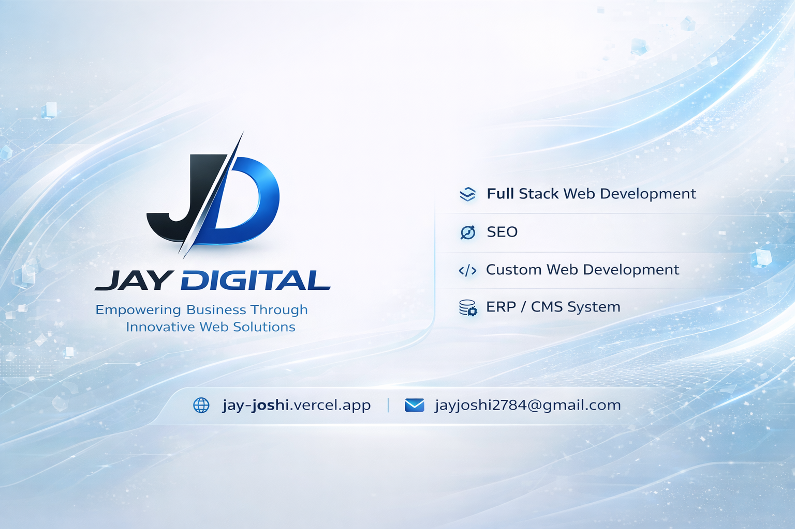

# Jay Joshi — Full Stack Engineer Portfolio

A immersive digital experience showcasing my journey as a Full Stack Developer. Built with a focus on high-performance 3D graphics, elegant animations, and robust software architecture using **Next.js**, **React**, and **Three.js**.



---

## 💎 Signature Features

### 🌌 Immersive Visualization

- **Advanced 3D Environments**: Powered by Three.js and React Three Fiber for a tactile, interactive feel.
- **Kinetic Animations**: Sophisticated motion design using Framer Motion and GSAP for fluid page transitions.
- **Quantum UI**: A premium glassmorphism aesthetic with dynamic blurs and custom-interpolated gradients.

### 🏛️ Architecture & UX

- **Serverless Performance**: Leverages Next.js App Router for optimal hydration and lightning-fast load times.
- **Persistent State**: Industry-standard state management with Zustand and local persistence.
- **Adaptive Precision**: Meticulously responsive layouts that maintain visual integrity across all viewport scales.
- **Semantic Excellence**: 100% compliant HTML5 for accessibility and search engine dominance.

---

## 🗺️ Digital Journey

| Destination       | Experience                                                               |
| :---------------- | :----------------------------------------------------------------------- |
| **Main Terminal** | Interactive hero section with real-time 3D elements and dynamic roles.   |
| **Biography**     | A deep dive into my philosophy, core stack, and creative process.        |
| **Showcase**      | Interactive 3D deck of projects featuring flip-card mechanics.           |
| **Tech Orbit**    | A floating 3D orbital visualization of my technical expertise.           |
| **Timeline**      | Chronological journey through professional milestones and education.     |
| **Credentials**   | Curated gallery of professional certifications with glass-stack effects. |
| **Nexus**         | Secure contact gateway integrated with automated validation.             |

---

## 🛠️ The Technology Stack

| Ecosystem          | Weapon of Choice                   |
| :----------------- | :--------------------------------- |
| **Framework**      | Next.js 16, React 19               |
| **Language**       | TypeScript (Strict Mode)           |
| **Styling**        | Tailwind CSS, Modern CSS variables |
| **3D Engine**      | Three.js, R3F, Drei                |
| **Motion**         | Framer Motion, GSAP                |
| **State**          | Zustand                            |
| **Data Integrity** | Zod, React Hook Form               |
| **UI Core**        | Radix UI, shadcn/ui                |

---

## 🏗️ Project Topology

```text
├── app/                    # Next.js App Router Architecture
├── components/
│   ├── home/               # Core section components
│   ├── layout/             # Universal navigation & footer
│   ├── three/              # Advanced 3D scenes & controllers
│   ├── transitions/        # Creative motion wrappers
│   └── ui/                 # Atomic design components
├── hooks/                  # Logic abstraction layer
├── lib/                    # Technical SEO & Utilities
├── store/                  # Centralized state management
└── public/                 # Static asset optimization
```

---

## 🚀 Execution Guide

### Prerequisites

- **Node.js**: Recommended >= 18.x
- **Package Manager**: npm or yarn

### Local Setup

```bash
# 1. Acquire the source
git clone https://github.com/imjayjoshi/portfolio.git

# 2. Synchronize dependencies
npm install

# 3. Ignite development environment
npm run dev
```

### Production Deployment

```bash
# Compile and optimize
npm run build

# Launch production instance
npm start
```

---

## ⚙️ Customization

- **Content**: All portfolio data is centralized in `store/portfolioStore.ts` for rapid updates.
- **Aesthetics**: Global design tokens and color variables are located in `app/globals.css`.
- **Communications**: Contact integration utilizes Web3Forms; configure your API key in the store.

---

## 👤 Interaction & Networking

**Jay Joshi**
_Full Stack Developer & AI Enthusiast_

- 🌐 [Live Portfolio](https://jay-joshi.vercel.app)
- 💼 [LinkedIn](https://linkedin.com/in/jay-joshi2708)
- 🐙 [GitHub](https://github.com/imjayjoshi)
- 🐦 [Twitter](https://twitter.com/jayjoshi278)
- 📧 [Email](mailto:jayjoshi2784@gmail.com)

---

<p align="center">
  Crafted with precision by Jay Joshi
</p>
